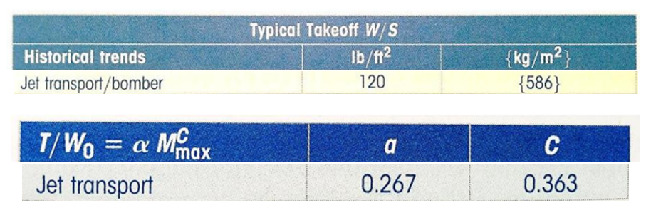
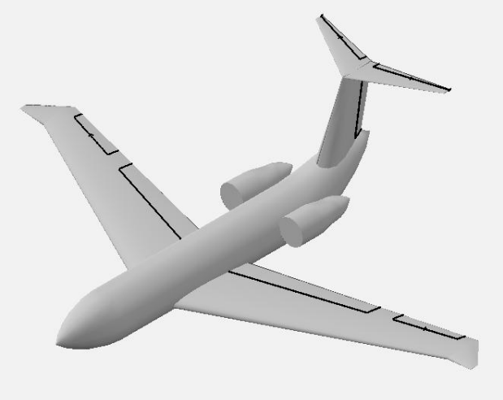
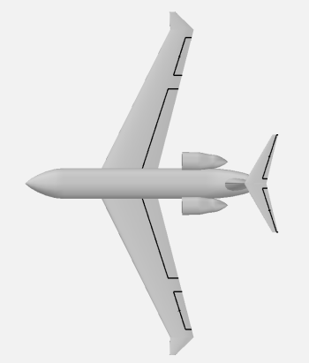

#VIP Business Jet – Conceptual Aircraft Design
---
##Overview

Conceptual design of a midsize VIP jet under transport-category performance constraints. The project followed a structured sizing approach beginning with mission definition, followed by constraint-based performance analysis, iterative refinement of wing loading and thrust-to-weight parameters, and integration of propulsion, fuel storage, and cabin layout considerations.

Initial performance estimates produced excessive takeoff field length (>10,000 ft). Iterative refinement of W/S and T/W selections reduced runway requirements while maintaining cruise efficiency and mission range targets. The final configuration derived from the selected design parameters is shown in Figures 2 and 3.

 
##My Contributions and Engineering Process

###1. Mission Definition
- Established aircraft role and competitive range targets
- Developed mission profile and key performance requirements

###2. Constraint-Based Parameter Selection
- Calculated required wing loading (W/S) and thrust-to-weight ratio (T/W) values across multiple mission phases including takeoff, climb, cruise, ceiling, sustained turn, and landing
- Organized results to compare competing constraints across flight conditions
- Selected final W/S and T/W values that satisfied all mission requirements simultaneously
- Initial sizing based on historical correlations (Figure 1) resulted in excessive takeoff field length (>10,000 ft), prompting iterative refinement of W/S and T/W.

###3. Propulsion & Fuel System Considerations
- Developed conceptual fuel storage layout utilizing wing integral tanks and supplemental fuselage bladder tanks
- Evaluated tradeoffs between fuel capacity and cabin space
- Proposed fuel burn sequencing approach to minimize longitudinal CG migration
- Included ullage allowance (~4%) to account for thermal expansion margin

###4. Cabin & Crew Layout
- Developed crew station layout with visibility and operational constraints in mind
- Configured passenger cabin consistent with mission and weight objectives

###5. Project Coordination
- Organized team meetings and deliverables
- Managed formatting and technical compilation

##Key Technical Insights
- Takeoff field length can dominate early aircraft sizing decisions
- Wing loading and thrust-to-weight ratio are strongly coupled in constraint-driven design
- Fuel placement significantly affects CG migration and trim drag
- Early assumptions propagate heavily into final geometry

  

  <em>Figure 1 – Historical Design Inputs</em>

  

  <em>Figure 2 – Aircraft Isometric View</em>

  

  <em>Figure 3 – Aircraft Top View</em>

