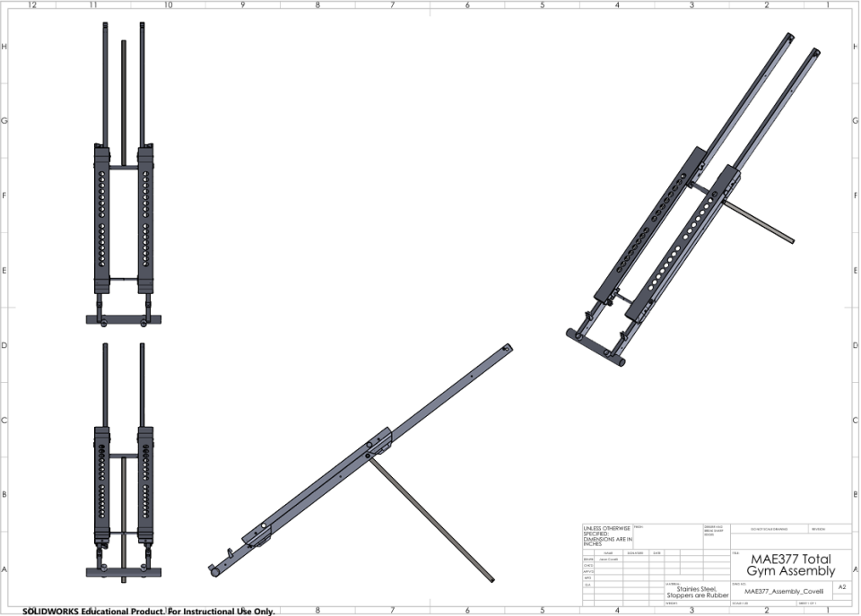
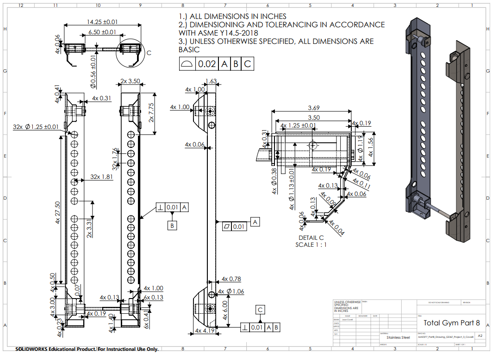
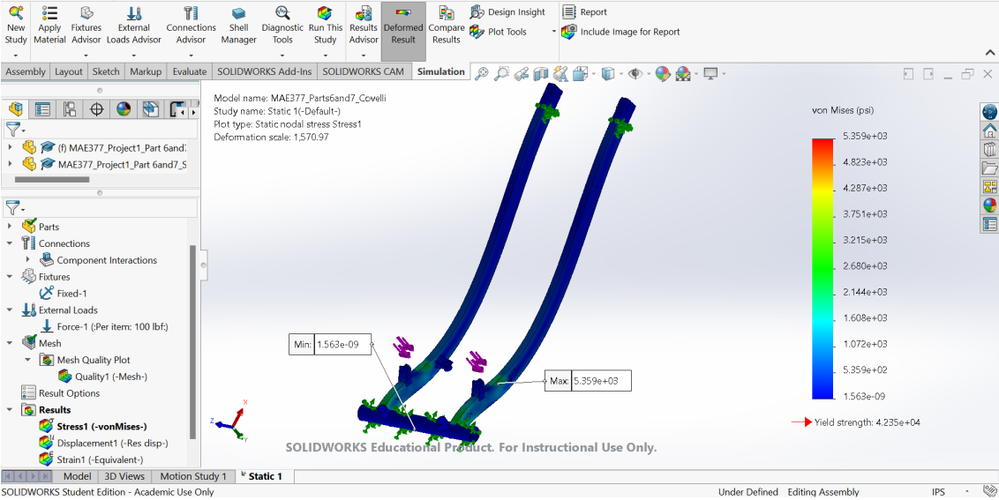
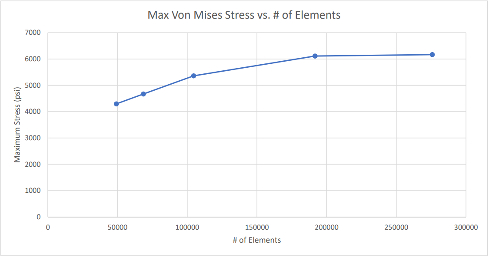

**Total Gym – Reverse Engineering & GD&T Analysis**
---

**Overview**

Reverse-engineered a commercial incline training system by physically measuring components (tape measure and calipers), reconstructing the geometry in SolidWorks, assembling the system, and producing manufacturing drawings with ASME Y14.5-compliant GD&T.  

The project emphasized functional datum selection, tolerance control of critical interfaces, and translation of physical hardware into a parametric CAD model suitable for manufacturing documentation.

---

**Assembly Modeling**

- Measured and modeled 7 structural components
- Built fully constrained parametric assembly
- Verified geometric relationships and mating interfaces through assembly constraints

  

  <em>Figure 1 – SolidWorks Assembly Model of Reverse-Engineered System</em>

---

**GD&T Application (ASME Y14.5)**

Manufacturing drawings were created for each modeled component with functional datum schemes selected based on load transfer and mating interfaces.

Key considerations included:

- Primary datum selection based on functional contact surfaces  
- Secondary datums selected to restrict remaining degrees of freedom  
- Application of flatness, perpendicularity, and size tolerances  
- Proper constraint of all six degrees of freedom through datum hierarchy
- Control of wheel mounts, structural joints, and connection features

  

  <em>Figure 2 – Representative Component Drawing with Functional Datum Structure</em>

---

**Structural Assessment (Static FEA)**

Select load-bearing components were evaluated using SolidWorks Simulation with a 400 lb distributed load applied to approximate worst-case static user loading.

- Identified stress concentrations
- Recognized boundary condition idealization significantly influenced local stress magnitude
- Observed stress amplification near sharp reentrant corner 
- Calculated factors of safety for primary support members  

Representative results:

  
  

  <em>Figure 3 – Stress Plot (left) and Mesh Convergence Behavior Plot (right)</em>

Analysis highlighted the importance of interpreting peak stresses near geometric discontinuities and recognizing potential singularities caused by sharp re-entrant features.

---

**Engineering Takeaways**

- Translating physical hardware into a fully constrained parametric assembly  
- Applying functional GD&T rather than decorative tolerancing  
- Understanding datum hierarchy and degree-of-freedom control  
- Recognizing limitations of simplified boundary conditions in FEA  
- Performed mesh refinement to assess stress sensitivity  

---

**Tools Used**

- SolidWorks (Part Modeling, Assembly, Drawings)  
- SolidWorks Simulation (Static Linear FEA)  
- Manual measurement tools (calipers, tape measure)
